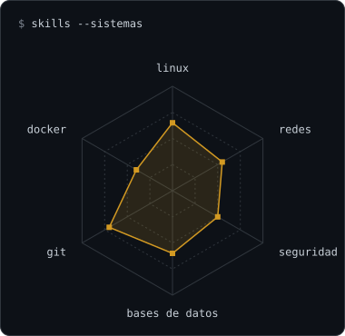
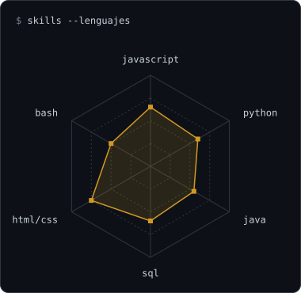

<a href="https://github.com/Karlo-n">
  <picture>
    <source media="(prefers-color-scheme: dark)" srcset="assets/banner-dark.svg">
    <source media="(prefers-color-scheme: light)" srcset="assets/banner-light.svg">
    
  </picture>
</a>

---

## `$ whoami`

  <picture>
    <source media="(prefers-color-scheme: dark)" srcset="assets/whoami-dark.svg">
    <source media="(prefers-color-scheme: light)" srcset="assets/whoami-light.svg">
    
  </picture>

## `$ cat stack.yaml`

<table>
  <thead>
    <tr><th colspan="2" align="left"><code>karl@tpsi:~$ cat stack.yaml</code></th></tr>
  </thead>
  <tbody>
    <tr>
      <td width="50%" valign="top"><code>├─ languages:</code>  
         
        <code>JavaScript · TypeScript · Python · Java · Bash</code>
      </td>
      <td width="50%" valign="top"><code>├─ web_backend:</code>  
         
        <code>HTML · CSS · React · Node.js · Express</code>
      </td>
    </tr>
    <tr>
      <td valign="top"><code>├─ databases:</code>  
         
        <code>MySQL · PostgreSQL · MongoDB · SQLite</code>
      </td>
      <td valign="top"><code>├─ systems_devops:</code>  
         
        <code>Linux · Ubuntu · Docker · Git · GitHub Actions</code>
      </td>
    </tr>
    <tr>
      <td colspan="2" valign="top"><code>╰─ security_tools:</code>  
        &nbsp;
        &nbsp;
        &nbsp;
        &nbsp;
         
        <code>Kali Linux · Wireshark · Burp Suite · Hack The Box · TryHackMe</code>
      </td>
    </tr>
  </tbody>
  <tfoot>
    <tr><td colspan="2"><code>status: learning&nbsp;&nbsp;·&nbsp;&nbsp;environment: development</code></td></tr>
  </tfoot>
</table>

---

## `$ skills --radar`

  <picture>
    <source media="(prefers-color-scheme: dark)" srcset="assets/radar-sys-dark.svg">
    <source media="(prefers-color-scheme: light)" srcset="assets/radar-sys-light.svg">
    
  </picture>&nbsp;
  <picture>
    <source media="(prefers-color-scheme: dark)" srcset="assets/radar-dev-dark.svg">
    <source media="(prefers-color-scheme: light)" srcset="assets/radar-dev-light.svg">
    
  </picture>

---

## `$ connect --socials`

  &nbsp;
  &nbsp;
  

 

<code>karl@tpsi:~$ exit</code>

