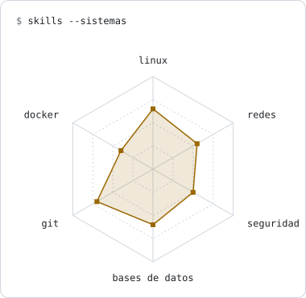
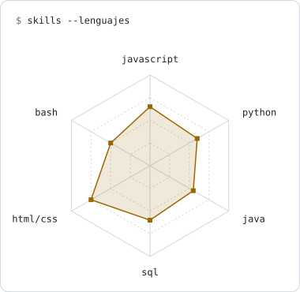

<picture>
  <source media="(prefers-color-scheme: dark)" srcset="assets/banner-dark.svg">
  
</picture>

## `$ whoami`

<picture>
  <source media="(prefers-color-scheme: dark)" srcset="assets/whoami-dark.svg">
  
</picture>

## `$ cat stack.yaml`

<table>
  <tr>
    <td width="50%" valign="top"><code>├─ lenguajes:</code>  
       
      <code>javascript · typescript · python · java · bash</code>
    </td>
    <td width="50%" valign="top"><code>├─ backend:</code>  
       
      <code>node · express · html · css</code>
    </td>
  </tr>
  <tr>
    <td valign="top"><code>├─ datos:</code>  
       
      <code>postgresql · mysql · sqlite</code>
    </td>
    <td valign="top"><code>├─ sistemas:</code>  
       
      <code>linux · git · docker</code>
    </td>
  </tr>
  <tr>
    <td colspan="2" valign="top"><code>╰─ seguridad:</code>  
      &nbsp;&nbsp;
      &nbsp;&nbsp;
      &nbsp;&nbsp;
       
      <code>wireshark · burp suite · kali · tryhackme</code>
    </td>
  </tr>
</table>

## `$ skills --radar`

  <picture>
    <source media="(prefers-color-scheme: dark)" srcset="assets/radar-sys-dark.svg">
    
  </picture>&nbsp;
  <picture>
    <source media="(prefers-color-scheme: dark)" srcset="assets/radar-dev-dark.svg">
    
  </picture>

<code>autoevaluación · se actualiza cuando aprendo algo nuevo</code>

## `$ connect`

  
  
  

<code>kold@tpsi:~$ exit</code>

